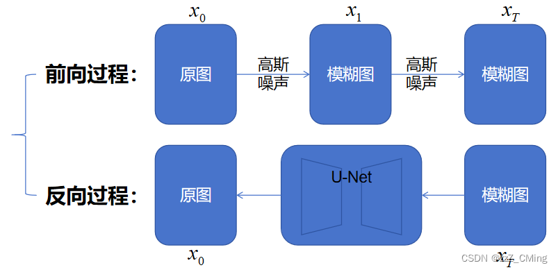

# DiT
DiT(Diffusion Transformer)，用 Transformer 替换 [LDM](https://zhuanlan.zhihu.com/p/683237596) (Latent Diffusion Model, 潜空间扩散模型)中的 U-Net. 

 DiT 最早是由 Facebook Research 提出的，后续在很多AI图像、视频生成任务(AIGC)中，比如OpenAI 的 Sora 视频生成模型，Stable Diffusion 等都是基于 DiT的。这些大厂的研究成果相互促进，同时也在互用代码，Facebook Research 的 DiT 代码也是建立在 OpenAI, StablityAI, 和 Google 的工作基础之上。

原始的 [facebookresearch DiT 模型代码](https://github.com/facebookresearch/dit) 提供了一个基本的模型代码，该基本模型的任务是用一个在 ImageNet 上预训练的模型，做一个根据 ImageNet 分类文本(分类编码)生成图片的任务。

我们对目标检测领域的 Yolo 比较熟悉，DiT 还处在研究过程中。DiT 模型不像 Yolo 那样，Ultralytics 把 Yolo 封装得很完善，在目标检测领域拿来就可以使用，最多用自己的数据集重新进行训练即可，模型本身不太需要调整(当然，高手除外)。DiT 的应用领域是 AIGC，目前 AIGC 领域有 Hugging Face 的 diffusers 库，封装了扩散领域的STOA(state of the art)模型。但是一则这个领域发展得很快，diffusers 不见得能容纳最新的研究成果；二则，要完成具体的任务，还是要根据自身的需求进行定制，根据自己的需求对模型作一些修改，并自行训练。

Diffusion(扩散)的基本过程是：前向添加高斯噪声破坏图像，反向从噪声恢复图像，如下图：

DiT 用 Transformer 结构替换了图中的 U-Net.

但这只是一个最基础的概念，DiT 中涉及的知识面很多，下面将一一对其进行分析：

## 编码
NLP 领域的 Transformer 结构是将输入文本转换为 q, k, v 3个张量, 如果 q, k, v 张量都来自于同样的输入文本，就是大名鼎鼎的 Self-Attention(自注意力机制)。NLP 的 q,k,v 都需要先将文本转化为 token, 也就是对文本进行编码，q,k,v 张量都来自于文本编码(embedding)+位置信息(pos)。
图像领域的 ViT 借鉴了 Transformer 的思想，将图像数据，时间步骤和影响条件同样转化为3个张量。

### 图像编码
ViT的编码基本思想是将图像切分为碎片(patch)。如果直接对像素进行碎片化(patchify)，比如一张 $256*256$ 的图片，假如按 $8*8$ 的大小切分，则图片将被切分为：$(256/8)^2=32^2=1024$个patch，每个patch有RGB 3个通道，总的 patch 数量就是 $1024*3=3072$ 个。图片越大，patch 数量将按平方值增长，当图片大了之后，像素级的碎片数量就太多了，显存负担很重。
所以，现在的碎片化都是用潜空间(latent space)，也就是先提取图片特征，在特征图上做碎片化，代替像素级，从而减少显存占用。
