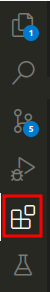

# 开发环境
Python 的开发环境搭建并不复杂。你只需要一个集成开发环境(IDE), 和选择一个虚拟环境管理工具。甚至 Python 包都可以交给 conda 去管理，而无需手动下载。

#### IDE
###### VS Code
我个人喜欢使用的 IDE 是 VS Code，主要是因为它是一个可扩展的IDE。
VS Code 的扩展组件非常丰富，无论是什么语言，几乎都可以在 VS Code 环境中搞定，这样就无需安装太多的 IDE。比如，我现在就是在 VS Code 环境中写 MarkDown 文档，而我用的是 Python 中的 mkdocs 管理文档，这些都无需再打开其它工具。由于我需要不断在 Chrome 中查询资料，假如打开的窗口太多，在不同窗口之间不断切换也很烦人。

[VS Code的下载链接](https://code.visualstudio.com/download)

安装完成之后，打开 VS Code，左侧工具栏选择“扩展”，在搜索框中搜索并安装一些必要的扩展组件：

* Chinese (Simplified) (简体中文) Language Pack for VS Code: 语言包，安装重启之后菜单显示成中文。
* Python: VS Code 的 Python 扩展组件，它会自动安装另外两个组件：Pylance 和 Python Debugger。提供的功能包括 Python 代码补全(Intelligence), 自动格式化(formatter)，语法检查(linter)等。

只需要这两个扩展组件，基本的 Python IDE 环境就准备好了。
VS Code 的使用并不复杂，但是有一些内容还是建议学习并掌握。这些内容不是必需的，新手完全可以跳过：
* 快捷键：建议熟悉一下 VS Code 的快捷键。如果是熟悉 Vim, Sublime 等编辑器的老鸟，VS Code 的快捷键同样也能很快熟悉。对于新手而言，熟练使用快捷键能很好地提升码字的效率。
* 工作区：如果你既要在 VS Code 中开发 Python 项目，同时还有 C++, Node.js 项目, 或者要用 Pytorch 作深度学习算法，那我建议你还是需要掌握 VS Code 工作区的概念，将同一类型的项目放到同一个工作区中去，以免装载的组件过多，影响效率。
  
好了！IDE准备好了，下面我们会准备一下虚拟环境。
###### PyCharm
【待续】

#### 虚拟环境
不同的 Python 项目需要依赖不同的软件包，我们不希望混淆各个项目所依赖的内容，所以在开发的时候，一般都是在某个虚拟环境中进行。
常见的 Python 虚拟环境管理工具是 conda 和 virtualenv，推荐使用 conda。一则 conda 是目前大多数知名项目使用的环境管理工具；二则 virtualenv 只能管理依赖包，对 Python 版本本身不能进行管理，而 conda 同时管理了 Python 版本和依赖包。
###### conda 
conda 有 Anaconda 和 Miniconda 两种版本，前一个是完整版，后一个是 mini 版。我几乎不使用更复杂的功能，所以 Miniconda 足够用。
[Miniconda 下载链接](https://docs.anaconda.com/miniconda/)
该链接中提供了快捷安装的脚本，以 Linux 为例，在 bash 中运行以下命令即可:
```Shell
mkdir -p ~/miniconda3
wget https://repo.anaconda.com/miniconda/Miniconda3-latest-Linux-x86_64.sh -O ~/miniconda3/miniconda.sh
bash ~/miniconda3/miniconda.sh -b -u -p ~/miniconda3
rm -rf ~/miniconda3/miniconda.sh
```
安装完成之后，关闭终端，再重启一个终端，运行如下命令作一下初始化：
```Shell
# 初始化 bash, 大多数 Linux 都是用 bash 作为默认 shell 环境，所以运行这条命令即可
~/miniconda3/bin/conda init bash 
# 初始化 zsh， Mac OS 默认的 shell 环境
~/miniconda3/bin/conda init zsh  
```
安装完成后，用 conda 新建一个虚拟环境：
```Shell
conda create --name my_env python=3.10 -y
```
将会新建一个只包含很少且必要依赖包的虚拟环境。然后可以用以下的命令激活和退出虚拟环境：
```Shell
# 激活虚拟环境
conda activate my_env
# 退出虚拟环境 
conda deactivate
```
虚拟环境就准备好了。

###### virtualenv
【待续】
#### 其它环境
###### Jupyter Notebook

###### Google Colab
Google Colab 是基于 Jupyter Notebook 的云产品，允许用户编写和执行 Python 代码,支持 GPU，可以在上面用云端的 GPU 跑深度学习的算法。
###### Kaggle Kernels
Kaggle 提供的 Jupyter Notebook 服务，允许用户编写和执行 Python 代码，并提供了 GPU 等计算资源的免费使用权限。不过，Kaggle 的 GPU 配额是每周动态分配的，通常在 30 到 40 小时之间。